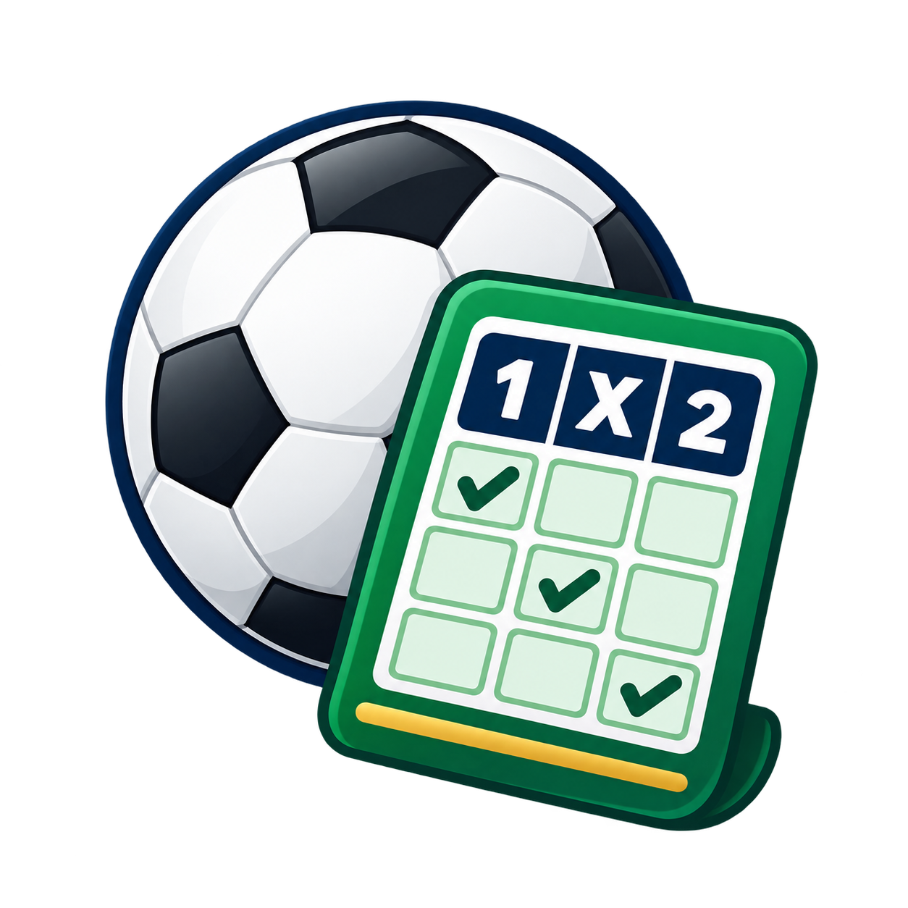

# Quiniela Local



Aplicación de Quiniela para escritorio y Android. La versión de escritorio
puede leer los datos instalados por WIN1X2; ambas versiones descargan datos,
porcentajes y marcadores directamente de sus proveedores públicos.

## Aplicación Android autónoma

El APK para Android 10 o posterior está en
[`dist/QuinielaLocal-Android-1.1.0.apk`](dist/QuinielaLocal-Android-1.1.0.apk).
Es compatible con el Samsung Galaxy S20+ y funciona sin PC ni servidor.

En el teléfono:

1. Descarga o copia el APK.
2. Ábrelo desde **Mis archivos**.
3. Si Android lo solicita, permite instalar aplicaciones desde esa fuente.
4. Instala **Quiniela Local** y pulsa **Actualizar datos**.

La aplicación Android descarga por sí sola la jornada, porcentajes y
resultados; conserva los pronósticos en el móvil y guarda las apuestas en
`Descargas/QuinielaLocal`. Incluye selecciones múltiples, generación y filtros,
optimización por presupuesto, importación/exportación TXT, marcadores,
comprobación de aciertos y escrutinio. La validación y el pago se realizan en la
web externa que se abre desde **Subir TXT y jugar**; la app nunca guarda
credenciales ni confirma compras.

La versión 1.1 incorpora las barras **Cobertura progresiva** y **Ajustes
rápidos** (0–10), distancia entre X, comparación/coincidencias, análisis,
histórico y consulta de temporadas y jornadas publicadas. Los desarrollos,
TXT importados y condiciones se guardan por temporada/jornada: al navegar no
se mezclan apuestas. Solo la jornada en curso admite edición; las anteriores
y futuras son de consulta. **En curso** vuelve a la quiniela editable.
Las descargas se ejecutan en segundo plano y los datos quedan disponibles
sin conexión tras la primera actualización. Véase [Android](android/README.md).

## Funciones de esta primera versión

- Detecta la temporada y la jornada vigente.
- Lee los 15 partidos y horarios desde `Datosg/PRE*.txt` y `Datosg/Hor*.txt`.
- El botón **Actualizar datos** vuelve a leer directamente la carpeta
  `WIN1X2/Datosg`; no usa ni mantiene una copia interna de esos ficheros.
- Traduce códigos mediante `Datosg/WEQUIPOS.TXT`.
- Calcula una orientación 1/X/2 con hasta ocho resultados recientes de cada
  equipo y una pequeña corrección por ventaja local.
- Guarda automáticamente el pronóstico del usuario.
- Exporta una quiniela legible en formato de texto.
- Valida y copia los 14 signos más el marcador del Pleno al 15.
- Abre la carga de archivos de Quinielista para validar y pagar el TXT después
  de que el usuario revise jornada, columnas, Pleno e importe.
- Genera entre 2 y 100 **columnas más probables**, ordenando combinaciones
  completas por la probabilidad conjunta de sus 14 signos sin recorrer de
  forma exhaustiva las 4.782.969 combinaciones posibles.
- Optimiza un presupuesto en euros y compara columnas sencillas, un desarrollo
  múltiple directo y las seis reducciones oficiales. Indica partidos fijos,
  dobles y triples, número de apuestas, coste y cobertura estimada.

El optimizador aplica el precio vigente de 0,75 € por apuesta y un mínimo de
dos apuestas. Las reducciones oficiales abaratan un desarrollo múltiple, pero
solo juegan una parte de sus combinaciones; la cobertura mostrada es una
estimación del modelo y no garantiza premio.

La probabilidad mostrada es un modelo sencillo, no una garantía ni una
recomendación de apuesta. Cuando no existe historial suficiente, se usa una
estimación neutral.

Por seguridad, Quiniela Local no guarda credenciales ni realiza compras. La
confirmación final se hace siempre en la web de validación elegida por el usuario.

## Ejecución

```bash
python3 quiniela_local/app.py
```

Si la aplicación no está dentro de la carpeta de WIN1X2, indica la carpeta de
datos de esta forma:

```bash
WIN1X2_DATA_DIR=/ruta/a/WIN1X2/Datosg python3 app.py
```

Para comprobar únicamente la lectura de datos:

```bash
python3 quiniela_local/app.py --check
```

`update_and_run.sh` actualiza el repositorio con un avance rápido desde GitHub
y abre la aplicación. Si no hay conexión, utiliza la última versión local.

## Seguimiento en directo

En **Comprobar aciertos y premios**, la pestaña **Marcadores en directo** consulta
el marcador público de Quinielista/Dataradar al abrir y cada 60 segundos. Puedes
desactivar el refresco automático o pulsar **Actualizar ahora**. Muestra la hora
de origen y de consulta; la frecuencia y el retraso de los resultados dependen
del proveedor. Si falla la conexión, avisa y conserva la última consulta visible.

**Tus aciertos provisionales** compara tu desarrollo o TXT con los partidos que
ya tienen marcador, sin tratar los pendientes como empates. Los confirmados
cuentan únicamente partidos finalizados; el máximo posible solo descuenta fallos
definitivos. El Pleno usa M para tres o más goles. No calcula premios a partir de
marcadores provisionales: **Escrutinio oficial** conserva la consulta de WIN1X2.
El directo valida temporada, jornada y numeración; si la fuente ya no ofrece una
jornada antigua, se puede consultar su escrutinio local.
